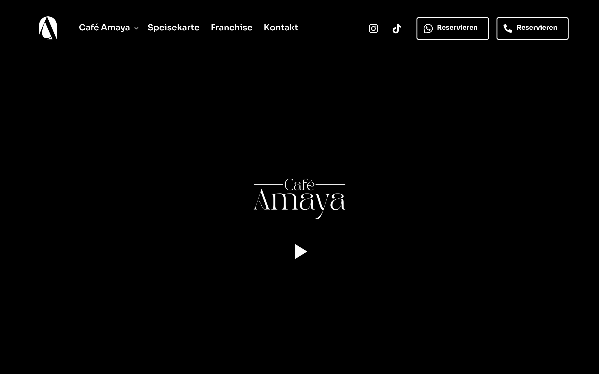

# cafe-amaya Design System

You are building UI for **cafe-amaya**. Dark-themed, cool palette, sans-serif typography (Inter), compact density on a 4px grid, expressive motion.

## Visual Reference

**IMPORTANT**: Study ALL screenshots below before writing any UI. Match colors, typography, spacing, layout, and motion exactly as shown.

### Homepage



> Read `references/DESIGN.md` for full token details.

## Design Philosophy

- **Layered depth** — use shadow tokens to create a sense of physical layering. Each elevation level has a specific shadow.
- **Gradient accents** — gradients are used thoughtfully for emphasis, not decoration.
- **Type pairing** — Inter for body/UI text, Sora for headings/display. Never introduce a third typeface.
- **compact density** — 4px base grid. Every dimension is a multiple of 4.
- **cool palette** — the color temperature runs cool, matching the sans-serif typography.
- **Restrained accent** — `#0080ff` is the only pop of color. Used exclusively for CTAs, links, focus rings, and active states.
- **Expressive motion** — animations are an integral part of the experience. Use spring physics and layout animations.

## Color System

### Core Palette

| Role | Token | Hex | Use |
|------|-------|-----|-----|
| Background | `--background` | `#000000` | Page/app background |
| Surface | `--surface` | `#07071a` | Cards, panels, modals |
| Text Primary | `--text-primary` | `#ffffff` | Headings, body text |
| Accent | `--accent` | `#0080ff` | CTAs, links, focus rings |

### Extended Palette

- `#e9ecf6` — Light surface or highlight color

### CSS Variable Tokens

```css
--one-kit-border-width: 0px;
--one-kit-border-width: 1px;
--one-kit-atom-border-width: 1px;
--one-kit-container-border-width: 1px;
--one-kit-border-width: 0;
--one-kit-border-width: 1px;
--one-kit-border-width: 2px;
--one-kit-border-width: 3px;
--one-kit-border-width: 4px;
--one-kit-border-width: 5px;
--one-kit-atom-border-width: 0;
--one-kit-atom-border-width: 1px;
--one-kit-atom-border-width: 2px;
--one-kit-atom-border-width: 3px;
--one-kit-atom-border-width: 4px;
--one-kit-atom-border-width: 5px;
--one-kit-container-border-width: 0;
--one-kit-container-border-width: 1px;
--one-kit-container-border-width: 2px;
--one-kit-container-border-width: 3px;
```

## Typography

### Font Stack

- **Inter** — Heading 1, Heading 2, Heading 3
- **Sora** — Body, Caption

### Font Sources

```css
@font-face {
  font-family: "Sora";
  src: url("fonts/Sora-Bold.ttf") format("truetype");
  font-weight: 700;
}
@font-face {
  font-family: "Sora";
  src: url("fonts/Sora-Regular.ttf") format("truetype");
  font-weight: 400;
}
@font-face {
  font-family: "Inter";
  src: url("fonts/Inter-Bold.ttf") format("truetype");
  font-weight: 700;
}
@font-face {
  font-family: "Inter";
  src: url("fonts/Inter-Regular.ttf") format("truetype");
  font-weight: 400;
}
@font-face {
  font-family: "Xing";
  src: url("data:font/woff2;charset=utf-8;base64,d09GMgABAAAAAAJoAAsAAAAABcAAAAIdAAEAAAAAAAAAAAAAAAAAAAAAAAAAAAAAHFQGVgCCcApAZAE2AiQDCAsGAAQgBYNmBzMbGAXIjgJ3BS3dYsj7F0Gw9r/Zs2+m8SdtYohINskkoiZCJRKhFEI1y2+/6S9/bIZH5eE7JWNt25G7zkvfNSxhwBgkSqMQEqUYOCdvTZIAGvnKwiiwA94OnOUFdKEDHfnD2AUu4RGBSvM2dNcPzu5g4XYkBpb0WdNBWh+3cx3BmEdkMlgoF4qac8/ihRzvvMdQ+PUH5qyCRJ6ymnav7qew9SXseQFtseY+yJFiGgCfOKz1bOvBzLSeSu1y3yCQyQRfolTybWKvZsH+Oqu2GnTDWPDFPSNAArJ4tgnoGnUbSUXlscfpIdxXVR3dCJ9H5cIhLDr2dW3rc9nZHfNHO8sLR/8+hvlPY6t+x/XBFhz76pdVfnLy8u/mucWV/+VVAT7//vAy5Pr5KN+LPrbG+3ZfIwkakhZN5HRNozYmqFSJEitQ72eq0ezUvjJZSqQyVUCG1BG5Kk1EIdNLVJqyzLauP9cTWYVQ7jwkErWuE6lyd4AMeULkWn0ohY68JSod9X2wyqj/4zeMviH9XEVWYd1FD2TbnA0Gs/PZTxySIRsJpRi/Y/uiQxGFynKNB2yEqoqxsVxQIm4m0qx4c1fr3nATruFJztBuEO1ZJWKZGAYfEAi025iBAi6/BTjUmFZmRJD03tg71HqhhYRQkOKVrIYOZmF7dlYqDDX1ywokIVzZiFRjhWdPUn09rmSWse6f6IbxJFpTFbdZs/N2VWYAAA==") format("woff2");
  font-weight: 400;
}
```

### Type Scale

| Role | Family | Size | Weight |
|------|--------|------|--------|
| Heading 1 | Inter | 26px | 700 |
| Heading 2 | Inter | 20px | 700 |
| Heading 3 | Inter | 18px | 700 |
| Body | Sora | var(--one-kit-size,16px) | 400 |
| Caption | Sora | var(--button-size,16px) | 400 |

### Typography Rules

- Body/UI: **Inter**, Headings: **Sora** — these are the only display fonts
- Max 3-4 font sizes per screen
- Headings: weight 600-700, body: weight 400
- Use color and opacity for text hierarchy, not additional font sizes
- Line height: 1.5 for body, 1.2 for headings

## Spacing & Layout

### Base Grid: 4px

Every dimension (margin, padding, gap, width, height) must be a multiple of **4px**.

### Spacing Scale

`2, 4, 6, 8, 10, 12, 16, 24, 32, 36, 40, 80` px

### Spacing as Meaning

| Spacing | Use |
|---------|-----|
| 4-8px | Tight: related items (icon + label, avatar + name) |
| 12-16px | Medium: between groups within a section |
| 24-32px | Wide: between distinct sections |
| 48px+ | Vast: major page section breaks |

### Border Radius

Scale: `4px, 6px, 8px, 10px, 100px, unset`
Default: `10px`

### Container

Max-width: `992px`, centered with auto margins.

### Breakpoints

| Name | Value |
|------|-------|
| xs | 450px |
| md | 768px |
| lg | 992px |
| xl | 1200px |
| 2xl | 1366px |
| 2xl | 1440px |
| 2xl | 1600px |

Mobile-first: design for small screens, layer on responsive overrides.

## Component Patterns

### Card

```css
.card {
  background: #07071a;
  border-radius: 10px;
  padding: 16px;
  box-shadow: var(--one-kit-shadow);
}
```

```html
<div class="card">
  <h3>Card Title</h3>
  <p>Card content goes here.</p>
</div>
```

### Button

```css
/* Primary */
.btn-primary {
  background: #0080ff;
  color: #ffffff;
  border-radius: 10px;
  padding: 8px 16px;
  font-weight: 500;
  transition: opacity 150ms ease;
}
.btn-primary:hover { opacity: 0.9; }

/* Ghost */
.btn-ghost {
  background: transparent;
  border: 1px solid #444444;
  color: #ffffff;
  border-radius: 10px;
  padding: 8px 16px;
}
```

```html
<button class="btn-primary">Get Started</button>
<button class="btn-ghost">Learn More</button>
```

### Input

```css
.input {
  background: #000000;
  border: 1px solid #444444;
  border-radius: 10px;
  padding: 8px 12px;
  color: #ffffff;
  font-size: 14px;
}
.input:focus { border-color: #0080ff; outline: none; }
```

```html
<input class="input" type="text" placeholder="Search..." />
```

### Badge / Chip

```css
.badge {
  display: inline-flex;
  align-items: center;
  padding: 4px 8px;
  border-radius: 9999px;
  font-size: 12px;
  font-weight: 500;
  background: #07071a;
  color: #8c8c8c;
}
```

```html
<span class="badge">New</span>
<span class="badge">Beta</span>
```

### Modal / Dialog

```css
.modal-backdrop { background: rgba(0, 0, 0, 0.6); }
.modal {
  background: #07071a;
  border-radius: unset;
  padding: 24px;
  max-width: 480px;
  width: 90vw;
  box-shadow: 0 0 0 20px rgba(var(--color-bg),0);
}
```

```html
<div class="modal-backdrop">
  <div class="modal">
    <h2>Dialog Title</h2>
    <p>Dialog content.</p>
    <button class="btn-primary">Confirm</button>
    <button class="btn-ghost">Cancel</button>
  </div>
</div>
```

### Table

```css
.table { width: 100%; border-collapse: collapse; }
.table th {
  text-align: left;
  padding: 8px 12px;
  font-weight: 500;
  font-size: 12px;
  color: #8c8c8c;
  text-transform: uppercase;
  letter-spacing: 0.05em;
  border-bottom: 1px solid #444444;
}
.table td {
  padding: 12px;
  border-bottom: 1px solid #444444;
}
```

```html
<table class="table">
  <thead><tr><th>Name</th><th>Status</th><th>Date</th></tr></thead>
  <tbody>
    <tr><td>Item One</td><td>Active</td><td>Jan 1</td></tr>
    <tr><td>Item Two</td><td>Pending</td><td>Jan 2</td></tr>
  </tbody>
</table>
```

### Navigation

```css
.nav {
  display: flex;
  align-items: center;
  gap: 8px;
  padding: 12px 16px;
}
.nav-link {
  color: #8c8c8c;
  padding: 8px 12px;
  border-radius: 10px;
  transition: color 150ms;
}
.nav-link:hover { color: #ffffff; }
.nav-link.active { color: #0080ff; }
```

```html
<nav class="nav">
  <a href="/" class="nav-link active">Home</a>
  <a href="/about" class="nav-link">About</a>
  <a href="/pricing" class="nav-link">Pricing</a>
  <button class="btn-primary" style="margin-left: auto">Get Started</button>
</nav>
```

### Extracted Components

These components were found in the codebase:

**Button** (`html`)

**List** (`html`)

## Page Structure

The following page sections were detected:

- **Navigation** — Top navigation bar (2 items)
- **Hero** — Hero/banner section with headline and CTAs

When building pages, follow this section order and structure.

## Animation & Motion

This project uses **expressive motion**. Animations are part of the design language.

### CSS Animations

- `pulsate`
- `pulsate-infinite`
- `ripple-infinite`
- `pulsate-ripple-infinite`
- `pulsate-ripple-before-infinite`

### Motion Tokens

- **Duration scale:** `.01ms`, `.5s`, `100ms`, `200ms`, `300ms`, `400ms`, `500ms`, `600ms`, `700ms`, `800ms`
- **Easing functions:** `ease`, `ease-out`, `cubic-bezier(0,0,.4,1.8)`, `linear`, `cubic-bezier(0,.89,.13,.99)`
- **Animated properties:** `box-shadow`

### Motion Guidelines

- **Duration:** Use values from the duration scale above. Short (.01ms) for micro-interactions, long (800ms) for page transitions
- **Easing:** Use `ease` as the default easing curve
- **Direction:** Elements enter from bottom/right, exit to top/left
- **Reduced motion:** Always respect `prefers-reduced-motion` — disable animations when set

## Depth & Elevation

### Shadow Tokens

- Subtle: `0 0 0 var(--one-kit-border-width,0) rgba(var(--color-border),var(--alpha-border)),0 0 0 .1px rgba(var(--color-border),var(--alpha-border)) inset`
- Raised (cards, buttons): `var(--one-kit-shadow)`
- Raised (cards, buttons): `var(--one-kit-container-shadow)`
- Raised (cards, buttons): `0 0 0 0 rgba(var(--color-bg),.4)`
- Raised (cards, buttons): `0 0 0 0 rgba(var(--color-bg),0)`
- Raised (cards, buttons): `0 0 0 0 rgba(var(--color-bg),.3)`

### Z-Index Scale

`0, 1, 2, 3, 5, 10, 20, 100, 500, 1000, 9999, 10000, 999999, 10000000`

Use these exact values — never invent z-index values.

## Anti-Patterns (Never Do)

- **No blur effects** — no backdrop-blur, no filter: blur()
- **No zebra striping** — tables and lists use borders for separation
- **No invented colors** — every hex value must come from the palette above
- **No arbitrary spacing** — every dimension is a multiple of 4px
- **No extra fonts** — only Inter and Sora are allowed
- **No arbitrary border-radius** — use the scale: 4px, 6px, 8px, 10px, 100px
- **No opacity for disabled states** — use muted colors instead

## Workflow

1. **Read** `references/DESIGN.md` before writing any UI code
2. **Pick colors** from the Color System section — never invent new ones
3. **Set typography** — Inter, Sora only, using the type scale
4. **Build layout** on the 4px grid — check every margin, padding, gap
5. **Match components** to patterns above before creating new ones
6. **Apply elevation** — use shadow tokens
7. **Validate** — every value traces back to a design token. No magic numbers.

## Brand Spec

- **Favicon:** `https://onecdn.io/cdn-cgi/image/width=16,height=16,fit=contain/media/c33ddccb-e4fd-48da-b346-b5992a3e97f7/sm`
- **Site URL:** `https://www.cafe-amaya.de/`
- **Brand color:** `#0080ff`
- **Brand typeface:** Inter

## Quick Reference

```
Background:     #000000
Surface:        #07071a
Text:           #ffffff / (not extracted)
Accent:         #0080ff
Border:         (not extracted)
Font:           Inter
Spacing:        4px grid
Radius:         10px
Components:     7 detected
```

## When to Trigger

Activate this skill when:
- Creating new components, pages, or visual elements for cafe-amaya
- Writing CSS, Tailwind classes, styled-components, or inline styles
- Building page layouts, templates, or responsive designs
- Reviewing UI code for design consistency
- The user mentions "cafe-amaya" design, style, UI, or theme
- Generating mockups, wireframes, or visual prototypes

---

# Full Reference Files

> Every output file is embedded below. Claude has full design system context from /skills alone.

## Design System Tokens (DESIGN.md)

# cafe-amaya DESIGN.md

> Auto-generated design system — reverse-engineered via static analysis by skillui.
> Frameworks: None detected
> Colors: 5 · Fonts: 2 · Components: 7
> Icon library: not detected · State: not detected
> Primary theme: dark · Dark mode toggle: no · Motion: expressive

## Visual Reference

**Match this design exactly** — study colors, fonts, spacing, and component shapes before writing any UI code.


---

## 1. Visual Theme & Atmosphere

This is a **dark-themed** interface with a cool tone. Depth is expressed through layered shadows and subtle surface color variation. Typography pairs **Sora** for display/headings with **Inter** for body text, creating clear visual hierarchy through type contrast. Spacing follows a **4px base grid** (compact density), with scale: 2, 4, 6, 8, 10, 12, 16, 24px. The palette is predominantly monochromatic with **#0080ff** as the single accent color — used sparingly for interactive elements and emphasis. Motion is expressive — spring physics, layout animations, and staggered reveals are part of the visual language.

---

## 2. Color Palette & Roles

| Token | Hex | Role | Use |
|---|---|---|---|
| background | `#000000` | background | Page background, darkest surface |
| surface | `#07071a` | surface | Card and panel backgrounds |
| text-primary | `#ffffff` | text-primary | Headings and body text |
| accent | `#0080ff` | accent | CTAs, links, focus rings, active states |
| info | `#e9ecf6` | info | Informational highlights |

### CSS Variable Tokens

```css
--one-kit-border-width: 0px;
--one-kit-border-width: 1px;
--one-kit-atom-border-width: 1px;
--one-kit-container-border-width: 1px;
--one-kit-border-width: 0;
--one-kit-border-width: 1px;
--one-kit-border-width: 2px;
--one-kit-border-width: 3px;
--one-kit-border-width: 4px;
--one-kit-border-width: 5px;
--one-kit-atom-border-width: 0;
--one-kit-atom-border-width: 1px;
--one-kit-atom-border-width: 2px;
--one-kit-atom-border-width: 3px;
--one-kit-atom-border-width: 4px;
--one-kit-atom-border-width: 5px;
--one-kit-container-border-width: 0;
--one-kit-container-border-width: 1px;
--one-kit-container-border-width: 2px;
--one-kit-container-border-width: 3px;
```


---

## 3. Typography Rules

**Font Stack:**
- **Inter** — Heading 1, Heading 2, Heading 3
- **Sora** — Body, Caption

**Font Sources:**

```css
@font-face {
  font-family: "Sora";
  src: url("fonts/Sora-Bold.ttf") format("truetype");
  font-weight: 700;
}
@font-face {
  font-family: "Sora";
  src: url("fonts/Sora-Regular.ttf") format("truetype");
  font-weight: 400;
}
@font-face {
  font-family: "Inter";
  src: url("fonts/Inter-Bold.ttf") format("truetype");
  font-weight: 700;
}
@font-face {
  font-family: "Inter";
  src: url("fonts/Inter-Regular.ttf") format("truetype");
  font-weight: 400;
}
@font-face {
  font-family: "Xing";
  src: url("data:font/woff2;charset=utf-8;base64,d09GMgABAAAAAAJoAAsAAAAABcAAAAIdAAEAAAAAAAAAAAAAAAAAAAAAAAAAAAAAHFQGVgCCcApAZAE2AiQDCAsGAAQgBYNmBzMbGAXIjgJ3BS3dYsj7F0Gw9r/Zs2+m8SdtYohINskkoiZCJRKhFEI1y2+/6S9/bIZH5eE7JWNt25G7zkvfNSxhwBgkSqMQEqUYOCdvTZIAGvnKwiiwA94OnOUFdKEDHfnD2AUu4RGBSvM2dNcPzu5g4XYkBpb0WdNBWh+3cx3BmEdkMlgoF4qac8/ihRzvvMdQ+PUH5qyCRJ6ymnav7qew9SXseQFtseY+yJFiGgCfOKz1bOvBzLSeSu1y3yCQyQRfolTybWKvZsH+Oqu2GnTDWPDFPSNAArJ4tgnoGnUbSUXlscfpIdxXVR3dCJ9H5cIhLDr2dW3rc9nZHfNHO8sLR/8+hvlPY6t+x/XBFhz76pdVfnLy8u/mucWV/+VVAT7//vAy5Pr5KN+LPrbG+3ZfIwkakhZN5HRNozYmqFSJEitQ72eq0ezUvjJZSqQyVUCG1BG5Kk1EIdNLVJqyzLauP9cTWYVQ7jwkErWuE6lyd4AMeULkWn0ohY68JSod9X2wyqj/4zeMviH9XEVWYd1FD2TbnA0Gs/PZTxySIRsJpRi/Y/uiQxGFynKNB2yEqoqxsVxQIm4m0qx4c1fr3nATruFJztBuEO1ZJWKZGAYfEAi025iBAi6/BTjUmFZmRJD03tg71HqhhYRQkOKVrIYOZmF7dlYqDDX1ywokIVzZiFRjhWdPUn09rmSWse6f6IbxJFpTFbdZs/N2VWYAAA==") format("woff2");
  font-weight: 400;
}
```

| Role | Font | Size | Weight |
|---|---|---|---|
| Heading 1 | Inter | 26px | 700 |
| Heading 2 | Inter | 20px | 700 |
| Heading 3 | Inter | 18px | 700 |
| Body | Sora | var(--one-kit-size,16px) | 400 |
| Caption | Sora | var(--button-size,16px) | 400 |

**Typographic Rules:**
- Limit to 2 font families max per screen
- Use **Inter** for body/UI text, **Sora** for display/headings
- Maintain consistent hierarchy: no more than 3-4 font sizes per screen
- Headings use bold (600-700), body uses regular (400)
- Line height: 1.5 for body text, 1.2 for headings
- Use color and opacity for secondary hierarchy, not additional font sizes


---

## 4. Component Stylings

### Navigation (1)

**Navigation** — `html`

### Data Display (1)

**List** — `html`

### Data Input (1)

**Button** — `html`
- Animation: 

### Overlay (1)

**Modal** — `html`

### Media (3)

**Image** — `html`

**Icon** — `html`

**Map/Canvas** — `html`


---

## 5. Layout Principles

- **Base spacing unit:** 4px
- **Spacing scale:** 2, 4, 6, 8, 10, 12, 16, 24, 32, 36, 40, 80
- **Border radius:** 4px, 6px, 8px, 10px, 100px, unset
- **Max content width:** 992px

**Spacing as Meaning:**
| Spacing | Use |
|---|---|
| 4-8px | Tight: related items within a group |
| 12-16px | Medium: between groups |
| 24-32px | Wide: between sections |
| 48px+ | Vast: major section breaks |


---

## 6. Depth & Elevation

### Flat — subtle depth hints

- `0 0 0 var(--one-kit-border-width,0) rgba(var(--color-border),var(--alpha-border)),0 0 0 .1px rgba(var(--color-border),var(--alpha-border)) inset`

### Raised — cards, buttons, interactive elements

- `var(--one-kit-shadow)`
- `var(--one-kit-container-shadow)`
- `0 0 0 0 rgba(var(--color-bg),.4)`

### Floating — dropdowns, popovers, modals

- `0 0 0 20px rgba(var(--color-bg),0)`
- `0 0 0 15px rgba(var(--color-bg),0)`

### Overlay — full-screen overlays, top-level dialogs

- `8px 8px 40px rgba(0,0,0,.1)`

### Z-Index Scale

`0, 1, 2, 3, 5, 10, 20, 100, 500, 1000, 9999, 10000, 999999, 10000000`


---

## 7. Animation & Motion

This project uses **expressive motion**. Animations are an integral part of the experience.

### CSS Animations

- `@keyframes pulsate`
- `@keyframes pulsate-infinite`
- `@keyframes ripple-infinite`
- `@keyframes pulsate-ripple-infinite`
- `@keyframes pulsate-ripple-before-infinite`
- `@keyframes blink-infinite`
- `@keyframes hard-blink-infinite`
- `@keyframes bounce-infinite`

### Animated Components

- **Button**: 

### Motion Guidelines

- Duration: 150-300ms for micro-interactions, 300-500ms for page transitions
- Easing: `ease-out` for enters, `ease-in` for exits
- Always respect `prefers-reduced-motion`


---

## 8. Do's and Don'ts

### Do's

- Use `#0080ff` for interactive elements (buttons, links, focus rings)
- Use `#000000` as the primary page background
- Pair **Inter** (body) with **Sora** (display) — these are the only allowed fonts
- Follow the **4px** spacing grid for all margins, padding, and gaps
- Use the defined shadow tokens for elevation — see Section 6
- Use border-radius from the scale: 4px, 6px, 8px, 10px, 100px
- Reuse existing components from Section 4 before creating new ones

### Don'ts

- Don't introduce colors outside this palette — extend the design tokens first
- Don't introduce additional font families beyond Inter and Sora
- Don't use arbitrary spacing values — stick to multiples of 4px
- Don't create custom box-shadow values outside the system tokens
- Don't use arbitrary border-radius values — pick from the defined scale
- Don't duplicate component patterns — check Section 4 first
- Don't use backdrop-blur or blur effects

### Anti-Patterns (detected from codebase)

- No blur or backdrop-blur effects
- No zebra striping on tables/lists


---

## 9. Responsive Behavior

| Name | Value | Source |
|---|---|---|
| xs | 450px | css |
| md | 768px | css |
| lg | 992px | css |
| xl | 1200px | css |
| 2xl | 1366px | css |
| 2xl | 1440px | css |
| 2xl | 1600px | css |

**Approach:** Use `@media (min-width: ...)` queries matching the breakpoints above.


---

## 10. Agent Prompt Guide

Use these as starting points when building new UI:

### Build a Card

```
Background: #07071a
Border: 1px solid var(--border)
Radius: 10px
Padding: 16px
Font: Inter
Use shadow tokens from Section 6.
```

### Build a Button

```
Primary: bg #0080ff, text white
Ghost: bg transparent, border var(--border)
Padding: 8px 16px
Radius: 10px
Hover: opacity 0.9 or lighter shade
Focus: ring with #0080ff
```

### Build a Page Layout

```
Background: #000000
Max-width: 992px, centered
Grid: 4px base
Responsive: mobile-first, breakpoints from Section 9
```

### Build a Stats Card

```
Surface: #07071a
Label: var(--text-muted) (muted, 12px, uppercase)
Value: #ffffff (primary, 24-32px, bold)
Status: use success/warning/danger from Section 2
```

### Build a Form

```
Input bg: #000000
Input border: 1px solid var(--border)
Focus: border-color #0080ff
Label: var(--text-muted) 12px
Spacing: 16px between fields
Radius: 10px
```

### General Component

```
1. Read DESIGN.md Sections 2-6 for tokens
2. Colors: only from palette
3. Font: Inter, type scale from Section 3
4. Spacing: 4px grid
5. Components: match patterns from Section 4
6. Elevation: shadow tokens
```

## Bundled Fonts (fonts/)

The following font files are bundled in the `fonts/` directory:

- `fonts/Inter-Black.ttf`
- `fonts/Inter-Bold.ttf`
- `fonts/Inter-ExtraBold.ttf`
- `fonts/Inter-ExtraLight.ttf`
- `fonts/Inter-Light.ttf`
- `fonts/Inter-Medium.ttf`
- `fonts/Inter-Regular.ttf`
- `fonts/Inter-SemiBold.ttf`
- `fonts/Inter-Thin.ttf`
- `fonts/Sora-Bold.ttf`
- `fonts/Sora-ExtraBold.ttf`
- `fonts/Sora-ExtraLight.ttf`
- `fonts/Sora-Light.ttf`
- `fonts/Sora-Medium.ttf`
- `fonts/Sora-Regular.ttf`
- `fonts/Sora-SemiBold.ttf`
- `fonts/Sora-Thin.ttf`

Use these local font files in `@font-face` declarations instead of fetching from Google Fonts.

## Homepage Screenshots (screenshots/)


